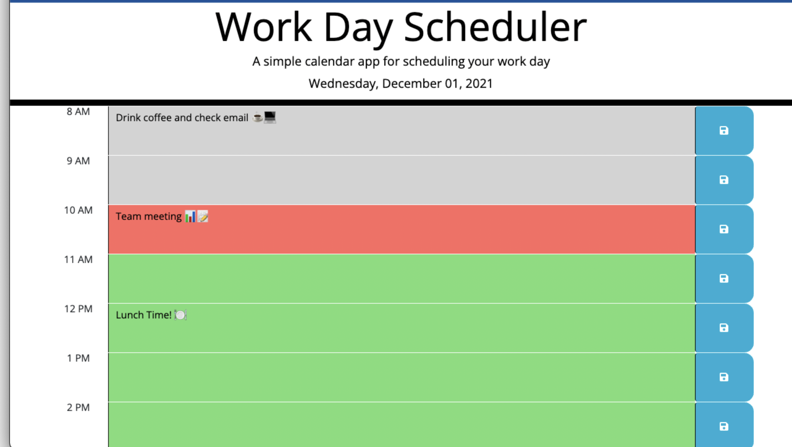

# Plan It

## Table of Contents
* [Description](#description)
* [Screenshot](#screenshot)
* [Link](#link)
* [Code](#code)
* [Contact](#contact)
* [Technologies](#technologies)
* [Project Status](#project-status)

## Description 
A simple daily planner using Moments to format date and time and saving tasks to local storage

## Screenshot

## Link
[Plan It Website](https://johny49.github.io/plan-it/)

## Code
[GitHub Code Repository](https://github.com/Johny49/plan-it)

## Contact 
Created by [@johny49](https://github.com/Johny49/) - feel free to contact me!

## Technologies
- HTML
- CSS
- JQuery
- Moments
_ Bootstrap

## Project Status
Project is: completed and functioning as intended.
